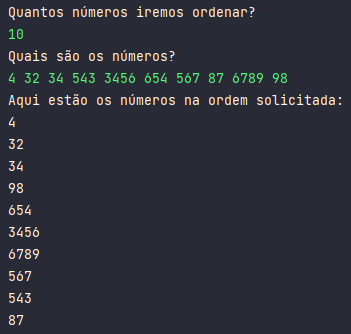

## Como eu resolvi esse desafio?

- Com o objetivo de ordenar respectivamente os números pares e impares em ordem crescente e decrescente, optei por separar logo no início os dois tipos em duas listas distintas.
- Para isso usei a condicional if com o operador %, se o resto da divisão for diferente de zero, significa que não é um número par e joga na lista de números impares.
- Após separação dos números, preciso fazer a ordenação deles, usei o `Collections.sort`, para os impares foi preciso adicionar o método `Collections.reverseOrder` que inverte a ordem da lista.
- Por fim, só faltava imprimir o resultado do cógigo, usei por exemplo o `for(int even: evenNum)`, é um equivalente ao forEach que tem em outras linguagens, nesse trecho, ele já vai trazer a lista de números pares que foram ordenadas anteriormente.
- Organizei a entrada e saída de números do console e o resultado pode ser visto na imagem abaixo:  

