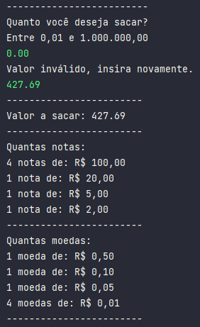

## Como eu resolvi esse desafio?

- Para esse desafio de simular um sistema de saque de dinheiro em espécie, sabia que para tratar de valores monetários, a tipagem ideal era o BigDecimal. 
Ele pode ser um pouco mais restrito e verboso em relação aos primitivos Double ou Float, mas a precisão e segurança que ele passa nos valores é bem superior.
- Logo no início, defini o valor mínimo e máximo passado nos requisitos do desafio e passei a validação com a condicional while. Se o valor que o usuário inseriu estiver dentro dos parâmetros, converte a String para um BigDecimal e começa o programa. 
- Criei então duas listas distintas com as notas e moedas presentes no "caixa eletrônico". Optei por definir esse valores como BigDecimal tamém para poupar parses posteriores.
- Iniciando a verificação do valor para calcular as notas e moedas necessárias, separei em dois laços for, um para o valor acima de 2 reais (notas) e outro para o valor abaixo de 2 reais (moedas).
- Optei por exibir apenas as notas e moedas que seriam utilizadas com aquele valor, então fiz Usando uma condicional if dentro do laço for.
- Editei um pouco de como apareceria os outputs no console para não parecer muito cru e quando finalizado, ficou conforme o exemplo abaixo:

  