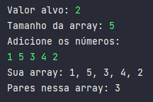

## Como eu resolvi esse desafio?

- Ao entender a proposta do desafio e seus requisitos, logo criei as variáveis que precisariam de inputs, como o valor alvo, a array com seu tamanho[n] e os elementos da array.
- O que precisava agora era o processo de verificação dos índices da array para calcular a diferença entre eles.  
Fiz isso com um laço for que iria percorrer os elementos e para calcular a diferença dos valores, usei o método `Math.abs(arr[i] - arr[j]);` que subtrai o valor do elemento atual com o do próximo da fila.  
- Se os elementos comparados tivessem a diferença com o valor definido na variável k, um contador adicionaria +1.
- Por fim, apenas organizei como tudo isso apareceria no console e o resultado pode ser visto na imagem abaixo: 

    

