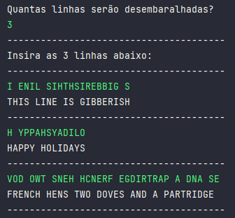

## Como eu resolvi esse desafio?

- Para resolver o problema de linhas embaralhadas, considerei a dica de que as linhas teriam um número par de caracteres e soube que seria dividindo-a na metade.
- Defini um loop for para repetir a solicitação de linha para o usuário o número de vezes que ele informou que precisaria.
- Após receber as linhas embaralhadas, criei um método `unshuffle`que iria dividi-las em duas partes e duas classes que receberiam essas partes. 
- Usando a classe `StringBuilder`, manipulei e inverti a ordem dos caracteres da parte esquerda e direita da String. No retorno, juntei as duas partes, mas agora já reestruturadas.  
- Separei e organizei como tudo isso apareceria no console e o resultado pode ser visto na imagem abaixo:

  